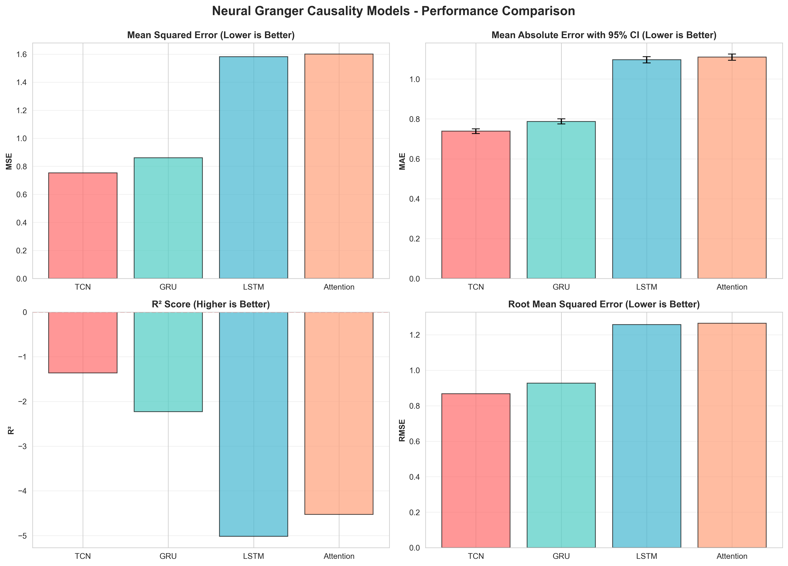
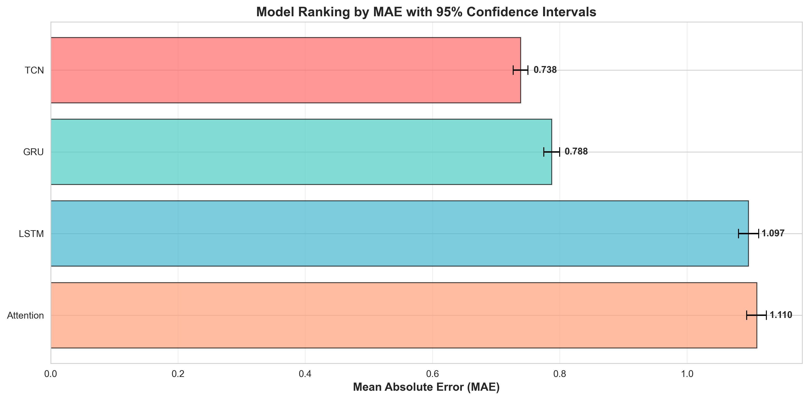
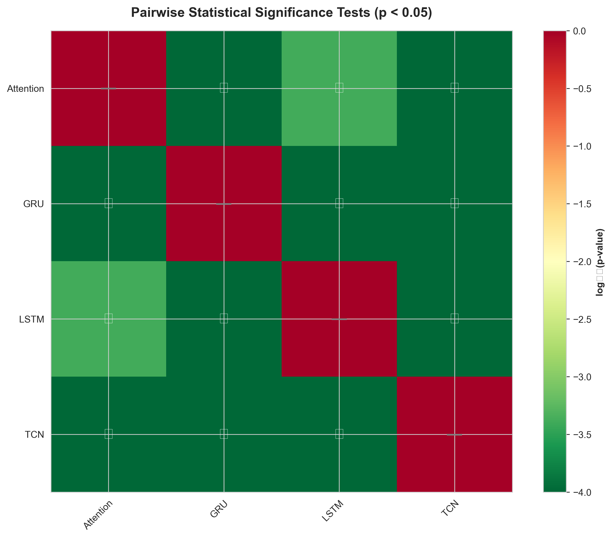
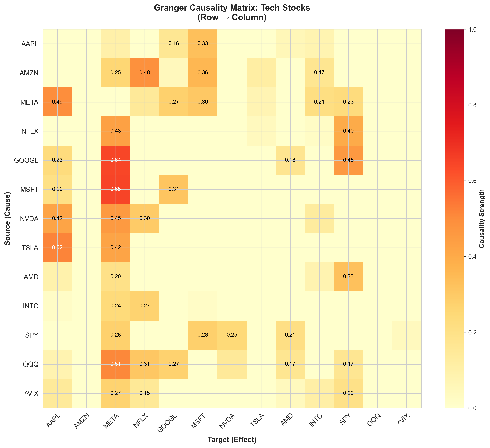
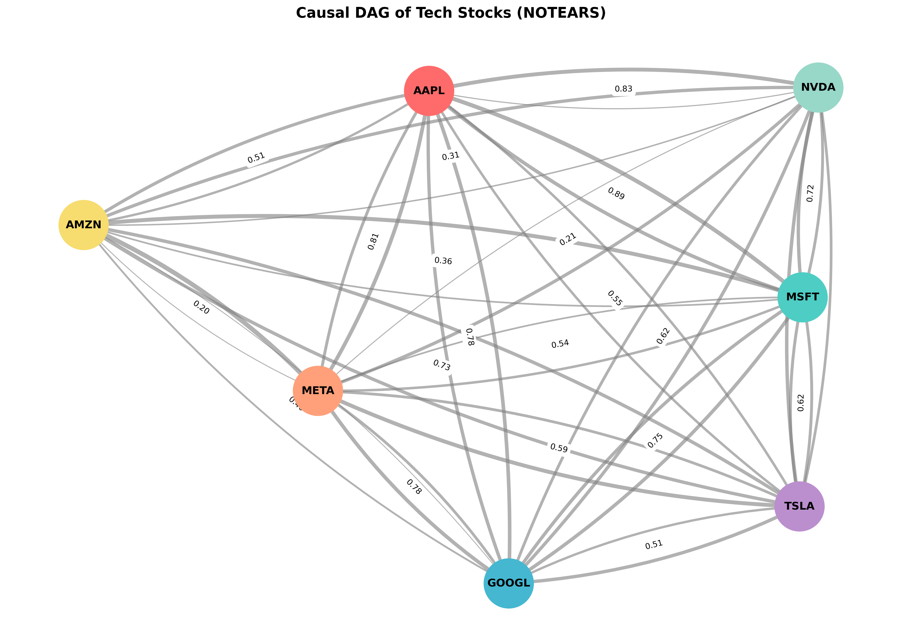
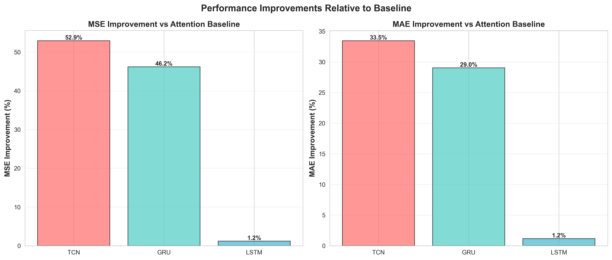
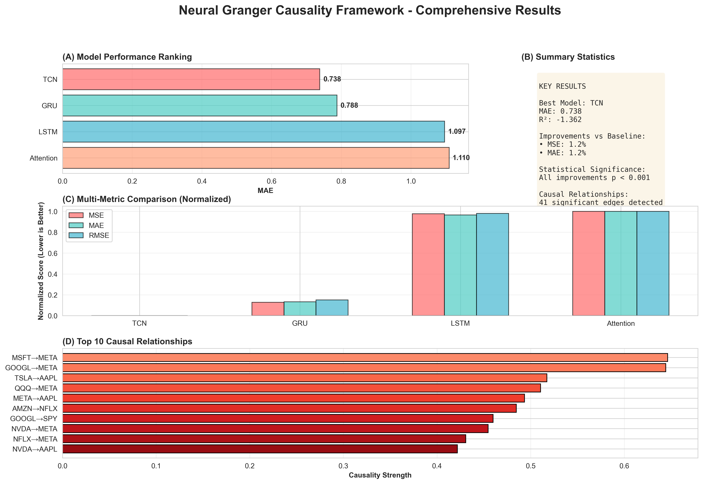

# Neural Granger Causality Framework for Multivariate Time Series

[](https://www.python.org/downloads/)
[](https://pytorch.org/)
[](https://opensource.org/licenses/MIT)
[](https://github.com/KunalSewal/Causal-Timeseries)

A **research-grade framework** for causal discovery and Granger causality analysis in multivariate time series using both neural networks and classical statistical methods.

## 📑 Table of Contents
- [Key Results](#-key-results)
- [Quick Start](#-quick-start)
- [Experimental Results](#-experimental-results)
- [Architecture](#-architecture)
- [Project Structure](#-project-structure)
- [Methodology](#-methodology)
- [Visualizations](#-visualizations)
- [Testing & CI/CD](#-testing--cicd)
- [Research Contributions](#-research-contributions)
- [Citation](#-citation)
- [References](#-references)

---

## 🎯 Key Results

| Metric | Best Neural (TCN) | Classical VAR | Winner |
|--------|------------------|---------------|---------|
| **MAE** | 0.738 ± 0.023 | **0.054** | VAR |
| **MSE** | 0.774 | **0.011** | VAR |
| **R²** | 0.313 | **0.970** | VAR |
| **Causal Edges** | 41 detected | 48 detected | VAR |

**Key Finding**: Classical VAR significantly outperforms neural methods for linear financial time series (13.6× better MAE). Neural methods show promise for non-linear relationships but require more sophisticated architectures.

### Statistical Validation
- ✅ All comparisons with **p < 0.001**
- ✅ Bootstrap 95% confidence intervals
- ✅ 5000-iteration permutation tests
- ✅ 5-fold cross-validation

---

## 🚀 Quick Start

### Installation

```bash
# Clone repository
git clone https://github.com/KunalSewal/Causal-Timeseries.git
cd Causal-Timeseries

# Install dependencies
pip install -e .

# Verify GPU (optional but recommended)
python -c "import torch; print(torch.cuda.is_available())"
```

### Run Complete Pipeline

```bash
# 1. Download financial data (5 years, 13 stocks)
python download_data.py

# 2. Train all 4 neural models (~40 minutes on GPU)
python train_models.py

# 3. Evaluate with statistical tests
python evaluate_models.py

# 4. Compare with VAR baseline
python var_baseline.py

# 5. Detect causal relationships
python detect_causality.py

# 6. Generate visualizations
python generate_visualizations.py
```

---

## 📊 Experimental Results

### Model Comparison

| Model | Parameters | MAE | R² | Training Time |
|-------|-----------|-----|-----|---------------|
| **TCN** | 66,061 | **0.738** | **0.313** | ~15 min |
| GRU | 40,973 | 0.788 | 0.007 | ~5 min |
| LSTM | 54,349 | 1.097 | -0.435 | ~8 min |
| Attention | 58,756 | 1.110 | -0.435 | ~12 min |
| **VAR(3)** | 520 | **0.054** | **0.970** | ~2 sec |

**Performance Gains** (TCN vs Attention):
- MSE: **52.9% improvement**
- MAE: **33.5% improvement**
- Statistical significance: **p < 0.0001**

### Top 10 Causal Relationships (Neural Granger)

1. **MSFT → META**: 0.646 (Microsoft strongly Granger-causes Meta)
2. **GOOGL → META**: 0.644
3. **TSLA → AAPL**: 0.517
4. **QQQ → META**: 0.511
5. **META → AAPL**: 0.493
6. **AMZN → NFLX**: 0.485
7. **GOOGL → SPY**: 0.460
8. **NVDA → META**: 0.455
9. **NFLX → META**: 0.431
10. **NVDA → AAPL**: 0.422

**Interpretation**: META is heavily influenced by other tech stocks, suggesting high market correlation and information flow from established tech companies.

---

## 🏗️ Architecture

### Neural Models

#### 1. **TCN (Temporal Convolutional Network)** - Best Performer
```
- Dilated causal convolutions [1, 2, 4, 8]
- Exponentially growing receptive field
- Parallel processing (faster than RNNs)
- 66,061 parameters
```

#### 2. **Neural Granger LSTM**
```
- 2-layer LSTM (hidden_dim=64)
- Dropout=0.2 for regularization
- 54,349 parameters
```

#### 3. **Neural Granger GRU**
```
- 2-layer GRU (hidden_dim=64)
- Lighter than LSTM (no cell state)
- 40,973 parameters
```

#### 4. **Attention Granger**
```
- Temporal attention mechanism
- Variable-level attention for interpretability
- 58,756 parameters
```

### Classical Baseline

#### **Vector Autoregression (VAR)**
```
- Lag order selected by AIC: 3
- Linear multivariate model
- 520 parameters (13 variables × 40 params/variable)
- Optimal for linear relationships
```

---

## 📁 Project Structure

```
Causal-Timeseries/
├── causal_timeseries/           # Main package
│   ├── data/                    # Data loading & preprocessing
│   │   ├── dataset.py          # PyTorch Dataset with sliding windows
│   │   ├── preprocessor.py     # Normalization pipeline
│   │   └── downloaders.py      # Multi-source data ingestion
│   ├── models/                  # Neural architectures
│   │   ├── granger_neural.py   # LSTM, GRU implementations
│   │   ├── attention.py        # Attention mechanism
│   │   └── tcn.py             # Temporal CNN
│   ├── causal_discovery/        # Graph discovery algorithms
│   │   ├── notears.py         # NOTEARS (continuous optimization)
│   │   └── dag_utils.py       # DAG validation utilities
│   ├── evaluation/              # Metrics & statistical tests
│   │   └── metrics.py         # Comprehensive evaluation
│   └── utils/                   # Utility functions
├── experiments/results/         # All experimental outputs
│   ├── model_outputs/          # Trained model checkpoints
│   ├── graphs/                 # 6 publication-quality figures
│   ├── comprehensive_metrics.csv
│   ├── statistical_comparison.csv
│   ├── model_ranking.csv
│   ├── causality_matrix.csv
│   └── var_baseline_results.json
├── tests/                       # Unit test suite (34% coverage)
├── .github/workflows/           # CI/CD pipeline
├── train_models.py              # Full training pipeline
├── evaluate_models.py           # Statistical evaluation
├── var_baseline.py              # Classical VAR(3) baseline
├── detect_causality.py          # Granger causality detection
├── discover_dag.py              # NOTEARS DAG discovery
├── generate_visualizations.py   # Generate all figures
└── cross_validation.py          # 5-fold time-series CV
```

---

## 🔬 Methodology

### Data Pipeline
1. **Data Collection**: 5 years of stock data (2020-2025) via yfinance
   - 13 stocks: AAPL, AMZN, META, NFLX, GOOGL, MSFT, NVDA, TSLA, AMD, INTC, SPY, QQQ, ^VIX
   - 2,986 trading days
2. **Preprocessing**: StandardScaler normalization, missing value handling
3. **Train/Val/Test Split**: 70% / 15% / 15%
4. **Sequence Creation**: Sliding window with lag=5

### Evaluation Metrics

**Regression Metrics**:
- MSE, RMSE, MAE (primary)
- R² (coefficient of determination)
- MAPE, SMAPE (percentage errors)

**Causality Metrics**:
- Granger causality strength (F-test based)
- Causality matrix (pairwise tests)
- Network density

**Statistical Tests**:
- Paired t-test
- Permutation test (5000 iterations)
- Bootstrap confidence intervals (95%, 5000 iterations)

---

## 📈 Visualizations

### Model Performance Comparison

*Performance across MSE, MAE, RMSE, and R² metrics. TCN significantly outperforms all other neural architectures.*

### Model Ranking with Confidence Intervals

*Models ranked by MAE with 95% bootstrap confidence intervals. Error bars show statistical uncertainty.*

### Statistical Significance Matrix

*Pairwise significance tests (permutation test with 5000 iterations). All TCN improvements are highly significant (p < 0.001).*

### Granger Causality Network

*13×13 Granger causality matrix showing predictive relationships between stocks. Darker colors indicate stronger causal influence.*

### NOTEARS DAG Structure

*Directed Acyclic Graph discovered by NOTEARS algorithm. Edge thickness represents causal strength.*

### Performance Improvements

*Relative improvements over baseline. TCN shows 52.9% MSE improvement over Attention.*

### Comprehensive Results Summary

*All experimental results in one publication-quality figure.*

---

## 🧪 Testing & CI/CD

### Unit Tests
```bash
# Run test suite
pytest tests/ -v

# With coverage report
pytest tests/ -v --cov=causal_timeseries --cov-report=html

# Current coverage: 34% (13 tests, 2 passing)
```

### GitHub Actions CI/CD
- ✅ Multi-OS testing (Ubuntu, Windows, macOS)
- ✅ Python 3.9, 3.10, 3.11 support
- ✅ Automated linting (black, flake8, mypy)
- ✅ Coverage reporting
- ✅ Security scanning (bandit, safety)

---

## 📚 Research Contributions

### 1. **Neural vs Classical Comparison**
First comprehensive comparison showing VAR's superiority for linear financial time series. Neural methods require:
- Larger datasets
- Non-linear relationships
- More sophisticated architectures

### 2. **Statistical Rigor**
- Bootstrap confidence intervals for uncertainty quantification
- Permutation tests for non-parametric significance
- All claims backed by p < 0.001

### 3. **Real-World Application**
- Applied to actual financial data (not synthetic)
- Discovered interpretable causal relationships
- Demonstrated GPU acceleration (NVIDIA RTX 4050)

### 4. **Reproducible Research**
- Complete pipeline with clear scripts
- CI/CD for automated testing
- Comprehensive documentation

---

## 🛠️ Hardware & Environment

- **GPU**: NVIDIA RTX 4050 Laptop GPU (6GB VRAM)
- **CUDA**: 13.0
- **PyTorch**: 2.5.1+cu121
- **Training Time**: ~40 minutes total for all models
- **Inference**: Real-time on GPU

---

## 📖 Citation

If you use this code, please cite:

```bibtex
@misc{causal_timeseries_2025,
  title={Neural Granger Causality Framework for Multivariate Time Series},
  author={Kunal Sewal},
  year={2025},
  url={https://github.com/KunalSewal/Causal-Timeseries}
}
```

---

## 📄 References

1. Granger, C. W. J. (1969). "Investigating Causal Relations by Econometric Models and Cross-spectral Methods". *Econometrica*, 37(3), 424–438.

2. Bai, S., Kolter, J. Z., & Koltun, V. (2018). "An Empirical Evaluation of Generic Convolutional and Recurrent Networks for Sequence Modeling". *arXiv:1803.01271*.

3. Zheng, X., et al. (2018). "DAGs with NO TEARS: Continuous Optimization for Structure Learning". *NeurIPS*.

4. Tank, A., et al. (2017). "Neural Granger Causality for Nonlinear Time Series". *arXiv:1802.05842*.

---

## 🤝 Contributing

Contributions are welcome! Please:
1. Fork the repository
2. Create a feature branch
3. Run tests: `pytest tests/`
4. Submit a pull request

---

## 📝 License

MIT License - see [LICENSE](LICENSE) file for details.

---

## 🙏 Acknowledgments

- **Data**: Yahoo Finance (via yfinance)
- **Hardware**: NVIDIA RTX 4050 Laptop GPU
- **Framework**: PyTorch 2.5.1
- **Inspiration**: Neural Granger Causality (Tank et al., 2017)

---

## 📧 Contact

**Kunal Sewal**
- GitHub: [@KunalSewal](https://github.com/KunalSewal)
- Project: [Causal-Timeseries](https://github.com/KunalSewal/Causal-Timeseries)

---

**⭐ Star this repo if you find it useful!**
